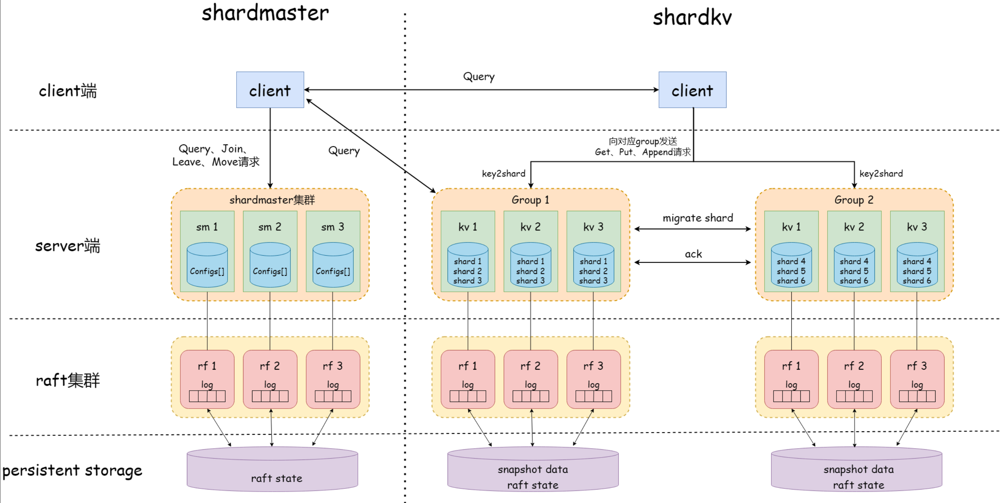

- [shardkv架构图](#shardkv架构图)
- [流程梳理过程的问题](#流程梳理过程的问题)


本项目参考了 [博客](https://blog.csdn.net/qq_43460956/article/details/134885751#42_shardmaster_352) 的实现。


# shardkv

这部分主要是实现Lab4B要求的shardkv的相关功能接口，具体来讲shardkv在kvraft的实现基础上，增加**数据分片**，由多个group分开管理、客户端请求分流的功能；具体可以参考如下的架构图：

# shardkv架构图




# 流程梳理过程的问题

## 1. `checkAndGetShard`中`WaitGroup`的使用解释

什么是 WaitGroup？

`sync.WaitGroup` 是 Go 语言中用于等待一组 goroutine 完成的同步原语。它类似于一个计数器。

在当前实例中的使用：
```go
// 初始：wg计数器 = 0
var wg sync.WaitGroup

// 循环处理每个shard
for _, shard := range [0, 2, 5] {  // 假设需要获取shard 0, 2, 5
    wg.Add(1)  // 计数器变为 1, 2, 3
    
    go func(shardNum int) {
        defer wg.Done()  // goroutine结束时计数器 -1
        
        // 请求shard数据...
        // 这个过程可能耗时不同
        
    }(shard)
}

// 此时有3个goroutine在并行运行
// 计数器 = 3

wg.Wait()  // 阻塞，直到计数器变为0（所有goroutine完成）

// 继续下一轮检查...
```

总的来说，通过WaitGroup来确保这一轮并发的所有请求都完毕后，再进行下一轮的检查


## 2. `executeConfigCmd`中的疑惑解答

在这其中有这么一段：

```go
	case GetShard:
		// 将从前任其他组请求到的shard数据更新到自己的kvDB
		// 重复的GetShard指令由第二个条件过滤
		if kv.curConfig.Num == op.CfgNum && kv.ownedShards[op.ShardNum] == WaitGet {
			kvMap := deepCopyMap(op.ShardData)
			// 修复：确保不覆盖已有数据
			if kv.kvDB[op.ShardNum] == nil {
				kv.kvDB[op.ShardNum] = make(map[string]string)
			}
			kv.kvDB[op.ShardNum] = kvMap        // 将迁移过来的shard数据副本保存在自己的键值服务器中
			kv.ownedShards[op.ShardNum] = Exist // 更新状态为WaitGet->Exist

			// 将shard前任所有者的session中较新的记录应用在自己的session，用于防止shard迁移后重复执行某指令带来结果错误
			for clientId, session := range op.SessionData {
				if ownSession, exist := kv.sessions[clientId]; !exist || session.LastCmdNum > ownSession.LastCmdNum {
					kv.sessions[clientId] = session
				}
			}

			DPrintf("DEBUG: Group[%d]ShardKV[%d] applied GetShard: shard=%d, keys=%d",
				kv.gid, kv.me, op.ShardNum, len(kvMap))
		}
```

在这个情况之下，需要做三件事
1. 将迁移过来的shard副本数据保存在自己的键值服务器中
2. 更新自己的状态：WaitGet->Exist
3. 需要的话将`session`复制过来，确保shard迁移后的客户端会话一致性

关于第三点需要理解一下这一段的含义：

```go
    // 将shard前任所有者的session中较新的记录应用在自己的session，用于防止shard迁移后重复执行某指令带来结果错误
    for clientId, session := range op.SessionData {
        if ownSession, exist := kv.sessions[clientId]; !exist || session.LastCmdNum > ownSession.LastCmdNum {
            kv.sessions[clientId] = session
        }
    }
```

意思是如果本地没有该client的session或者本地有但是迁移来的更新，那么需要更新本地的session，可以参考一个具体的迁移流程进行理解这个操作的必要性：

```go
// 1. Client 123向Group A执行操作
Put(key="user:1", value="Alice", clientId=123, cmdNum=10)
// Group A: sessions[123] = {LastCmdNum: 10, ...}

// 2. 配置变更，shard迁移到Group B
// Group A发送迁移数据
MigrateArgs{
    ShardData:   {"user:1": "Alice"},
    SessionData: {123: {LastCmdNum: 10, OpType: "Put", Response: {Err: OK}}}
}

// 3. Group B执行GetShard操作
kv.kvDB[shard]["user:1"] = "Alice"  // 应用数据
kv.sessions[123] = {LastCmdNum: 10, OpType: "Put", Response: {Err: OK}}  // 应用session

// 4. Client 123重发请求（网络原因）
Put(key="user:1", value="Alice", clientId=123, cmdNum=10)

// 5. Group B检查
if session, exist := kv.sessions[123]; exist && cmdNum <= session.LastCmdNum {
    // 10 <= 10，返回缓存结果，不重复执行 ✓
    return session.Response
}
```

没有这段代码的后果：
- 客户端重发的请求可能被重复执行
- 数据可能出现不一致
- 违反了"恰好执行一次"的语义

## 3. addEmptyLog存在的意义

`addEmptyLog`是为了解决 Raft 中的一个经典问题 - 日志提交的活锁问题。

addEmptyLog 的作用：定期检查当前 term 是否有日志，如果没有，主动添加空日志，触发旧日志的提交，打破活锁，确保系统始终能够取得进展。

### 3.1 什么是活锁
活锁：系统虽然没有死锁，各个进程都在运行，但是系统整体无法取得进展。在 Raft 中表现为：

- 所有节点都在正常工作，新的日志能够被复制，但是旧的日志永远无法被提交。

这是因为Raft的提交规则规定了：Leader只能提交当前term的日志条目，旧term的日志只有在当前term的日志提交时才能顺带提交。

基于以上说的，通过在应用端添加`addEmptyLog`可以解决这个问题。

```go
// 核心思想
// 当新 leader 上任后，如果当前 term 没有新的日志条目，就主动添加一条空日志，这样就能触发旧日志的提交。
func (kv *ShardKV) addEmptyLog() {
    for !kv.killed() {
        // 只有 leader 才进行检查
        if _, isLeader := kv.rf.GetState(); !isLeader {
            time.Sleep(time.Millisecond * ConfigCheckInterval)
            continue
        }

        // 检查当前 term 是否有日志
        if !kv.rf.CheckCurrentTermLog() {
            // 如果当前 term 没有日志，添加一条空日志
            emptyOp := Op{
                OpType: EmptyOp,
            }
            kv.rf.Start(emptyOp)  // 这会创建当前 term 的日志条目
        }
        time.Sleep(time.Millisecond * ConfigCheckInterval)
    }
}
```

以此配合`executeEmptyCmd`的处理

```go
func (kv *ShardKV) executeEmptyCmd(commandIndex int) {
    kv.mu.Lock()
    defer kv.mu.Unlock()

    // 空指令的重复检查
    if commandIndex <= kv.logLastApplied {
        return
    }
    
    // 跨快照检查
    if kv.passiveSnapshotBefore {
        if commandIndex-kv.logLastApplied != 1 {
            return
        }
        kv.passiveSnapshotBefore = false
    }
    
    // 只更新进度，不做任何实际操作
    kv.logLastApplied = commandIndex
    
    // 空指令不需要通知客户端，因为没有客户端等待它的结果
}
```

通过这个方法的实现避免了：
1. 配置变更可能停滞：如果配置变更的日志无法提交，整个 shard 迁移会卡住
2. shard 迁移依赖日志提交：GetShard、GiveShard 操作必须被提交才能完成
3. 防止系统死锁：确保系统始终能够取得进展